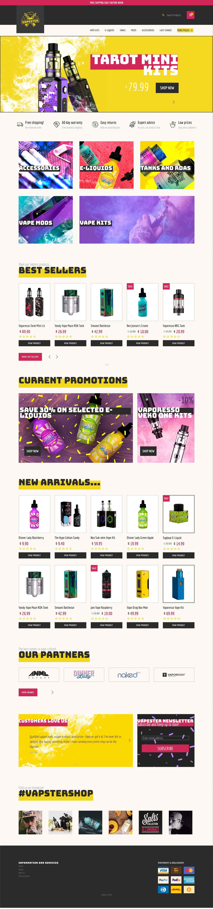
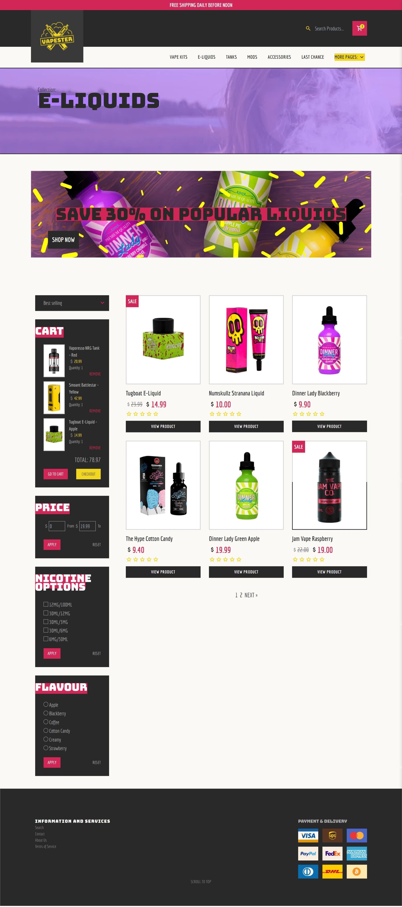
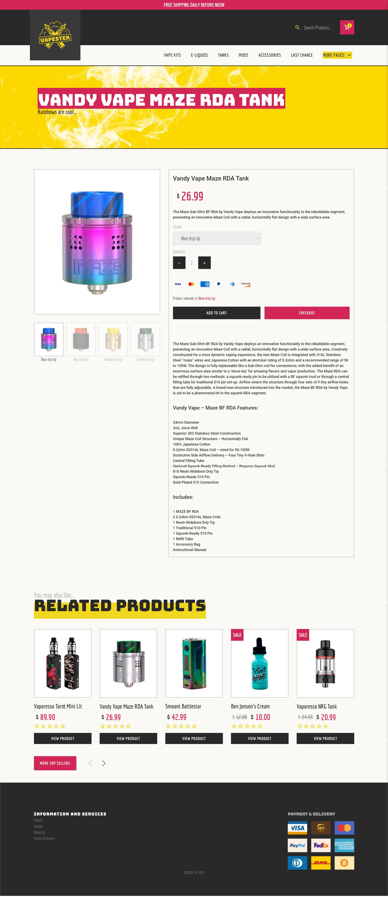

# Vapester - Shopify 2.0 Template

A Shopify 2.0 storefront template. The Vapester storefront is a complete e-commerce solution. This multipage site includes product collections, search, filtering, cart and checkout pages. All store data is held and managed by the Shopify CMS.

Built with vanilla tech:

   

• A customizable e‑commerce web solution template built with vanilla HTML, CSS and JS.

• All store content dynamially handled and managed by the Shopify CMS.

• Vapester utilizes Shopify 2.0 JSON templates to incorporate Shopify’s ’sections everywhere’ methodology to maximize customization options across all
pages/sections for store owners.

• Incorporates an AJAX API to enable seamless manipulation of cart data without requiring page reloads, enhancing the user experience.

• Deployed [SwiperJS](https://swiperjs.com/) to manage all section carousels, contributing to a smooth and intuitive UI/UX.

• Optimized page elements to decrease loading times and meticulously debugged code to ensure seamless cross‑browser compatibility.

• Incorporates [LeafletJS](https://leafletjs.com/) to provide users with the ability to visualize the locations of all store outlets, enhancing user engagement and
convenience.

#ajax #template #html #css #javascript #tilt #swiperjs #leafletjs #liquid #shopify #e-commerce #cart #checkout

Design by [Themerex](https://themerex.net/)

## Vapester pages 

### - Homepage

### - Collection 

### - Product 

### - About 

### - Contact

